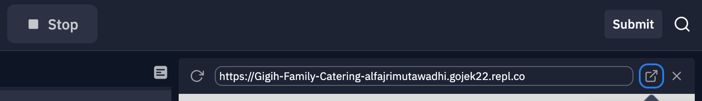
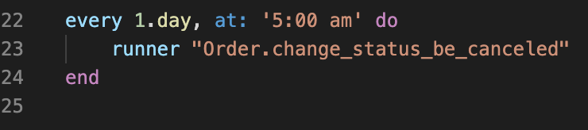

# API GIGIH Family Catering

ID = KM_G2BE1125 <br>
Name : Muhammad Mutawadhi' Alfajri

## How to run and check API

* Run Server
    * If you try in replit, click Run button
    * If you try in local, run this code in terminal
    ```
      rails server
    ```

* Copy URL Rails server
    
<br>
<br>
* Open Postman application <br>
    You can follow API documentation in <a href="https://documenter.getpostman.com/view/18981976/UyrAFwjv">https://documenter.getpostman.com/view/18981976/UyrAFwjv</a><br>
    or <br>
    [](https://god.postman.co/run-collection/80ffaeafc02e19d403fa?action=collection%2Fimport)
<br>
<br>
* This project has a feature to change the status of all orders that have not been paid for today to "CANCELLED" every 5 pm <br>
    * if you want to try it, please set the time in the config/schedule.rb file to your current time plus 1 minute
        
    * Then, you can update whenever by writing this text in the terminal
    ```
        whenever --update-crontab
    ```
    * If the time has exceeded the time limit you have set, you can check your database again and see the status changes in the orders table
<br>
<br>
* Good luck and thank you :)
